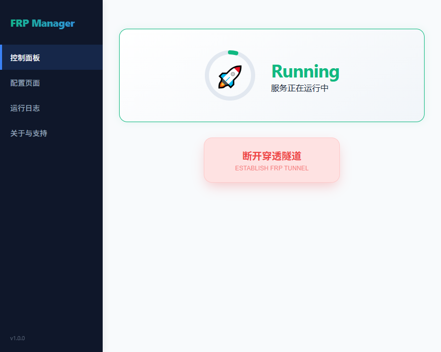

# 🚀 Mole FRP Manager (Beta)

**Mole** 是一款基于 **Wails 3** 开发的轻量级、跨平台 **frp (Fast Reverse Proxy)** GUI 管理工具。

不同于传统的重型桌面应用，Mole 追求极简与高性能，内嵌 frp 客户端，为您提供丝滑的内网穿透管理体验。

**🔗 访问官网获取更多内容：[91demo.top](https://www.91demo.top)**

---

## ✨ 核心特性

- ⚡ **极致轻量**：基于 Wails 3 构建，无 Chromium 运行时负担，内存占用极低，启动秒开。
- 📜 **高性能日志系统**：支持后端日志 500ms 批量缓冲推送技术，在高频穿透请求下 UI 依然稳如泰山。
- 🛠️ **多协议支持**：直观管理 HTTP、TCP、UDP 规则，支持实时配置校验。
- 🎨 **现代交互设计**：针对窄窗口优化的“元数据+内容”双行日志布局，信息层级清晰。

## 📸 界面预览



## 🚀 快速开始

### 开发模式

在命令行中切换到项目目录，运行以下命令启动热加载开发环境：

```bash
wails3 dev
```

**注意**：本工具通过调用 bin 目录下的 frpc 客户端来建立连接。

- 初次使用：请手动将 resources/bin.zip 内的文件解压到 bin 目录下。
- 版本维护：你可以根据需要自行替换 bin 里的 frpc 文件，以确保客户端版本与你的服务器版本完美匹配，需要确保名称保持一致。

### 生产编译

运行生产模式构建命令，生成跨平台可执行文件：

```bash
wails3 build
```

编译产物将存放在 build/bin 目录。

### 资源打包

在发布正式版前，更新 build/config.yml 内容并运行：

```bash
# 更新构建资产
wails3 update build-assets -name "mole" -config build/config.yml -dir build

# 执行打包
wails3 package
```

## 📂 项目架构

- 后端 (Go)：main.go 负责创建窗口，和管理应用声明周期，moleservice.go 负责 frp 进程生命周期管理、配置 TOML 自动化解析、日志流拦截与批量分发。
- 前端 (Vanilla JS)：main.js 负责逻辑处理和绑定后端 Go 的方法，其中 App.state 是唯一真相来源的状态中心，方法封装了连接、保存、配置修改等所有核心动作，以及高效的增量 DOM 渲染引擎。index.html 定义了客户端的桌面布局，style.css 定义了样式。

## 🤝 贡献与反馈

如果您在使用中遇到问题，或有更好的建议，欢迎提交 Issue 或 Pull Request。
官方网站：www.91demo.top

## ⚠️ 免责声明 (Disclaimer)

1. **法律合规**：本工具（Mole FRP Manager）仅供内部网络环境调试及合法技术研究使用。用户在使用本工具进行内网穿透时，必须遵守当地法律法规。严禁利用本工具从事任何违法违规活动（包括但不限于非法访问、数据窃取、攻击等）。
2. **安全风险**：内网穿透本质上会将局域网服务暴露至公网，可能带来安全风险。用户需自行负责服务端（frps）及客户端（frpc）的安全配置。因配置不当或软件漏洞导致的任何安全事故，作者不承担任何责任。
3. **无担保性**：本软件按“原样”提供，不附带任何形式的明示或暗示担保。作者不保证软件在所有环境下的稳定性，也不对因使用本软件导致的任何数据丢失、设备损坏或损失负责。
4. **最终解释权**：下载或使用本软件即代表您已阅读并同意上述条款。

## 📜 许可证

本项目基于 MIT License 开源，您可以自由地进行二次开发或引流使用。
Copyright © 2026 Eagle / www.91demo.top. Built with ❤️ and Wails 3.
